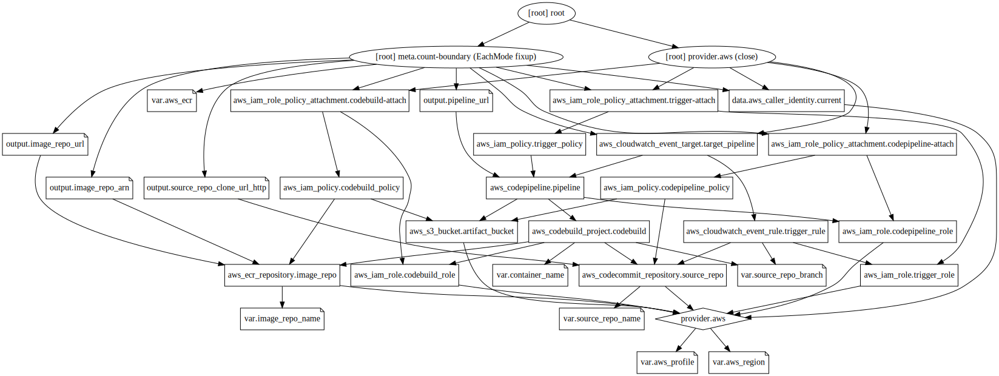

# ECR CodePipeline(CodeCommit, Codebuild) with Terraform

<br>

### 

<br>

### Sample `terraform.tfvars`

```shell
aws_region="ap-northeast-2"
aws_ecr="my-app"
aws_profile="default"
source_repo_name="my-app"
source_repo_branch="master"
image_repo_name="my-app"
```

<br>

## Set up repo

CodeCommit의 Repo 활용법은 아래 2가지 방법이 있다.

`terraform output`을 활용해 **export 환경 변수** 지정

```shell
export tf_source_repo_clone_url_http=$(terraform output source_repo_clone_url_http)
echo $tf_source_repo_clone_url_http	# 확인
```

<br>

### 방법 1. CodeCommit Repo 로컬에 clone하기 (비어있는 folder에서 진행)

```shell
git clone tf_source_repo_clone_url_http
```

> 이미 작업해둔 코드가 있다면, git clone 된 위치에 코드를 위치시키고 commit 한다
>
> ```shell
> git add .
> git commit -m "First commit"
> git status
> git push origin # master branch로 push
> ```

### 방법 2. 로컬에 새로운 Repo를 생성해 CodeCommit에 push하기 (비어있는 folder에서 진행)

```shell
git init
git add .
git commit -m "First commit"

git config --global credential.helper '!aws codecommit credential-helper $@'
git config --global credential.UseHttpPath true
```

CodeCommit Repo 사용을 위한 git remote 지정

```shell
git remote add origin $tf_source_repo_clone_url_http
git remote -v
```

<br>

---

Reference : [devops-ecs-fargate workshop](https://devops-ecs-fargate.workshop.aws/en/1-introduction.html)
