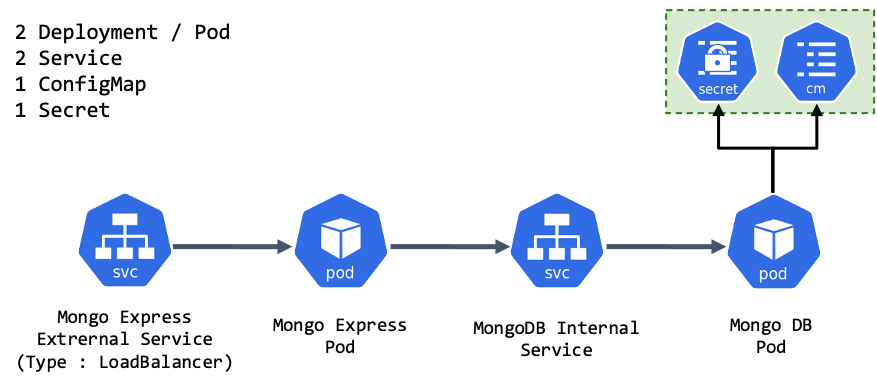

### MongoDB k8s Architecture



<br>

## Commands

### Get encoded string

```shell
$ echo -n 'username' | base64
$ echo -n 'password' | base64
```

### kubectl apply commands in order

    kubectl apply -f market.yaml

### kubectl get commands

    kubectl get pod
    kubectl get pod --watch
    kubectl get pod -o wide
    kubectl get service
    kubectl get secret
    kubectl get all | grep market

### kubectl debugging commands

    kubectl describe pod market-deployment-xxxxxx
    kubectl describe service market-service
    kubectl logs market-xxxxxx

### give a URL to external service in minikube

    minikube service market-service
